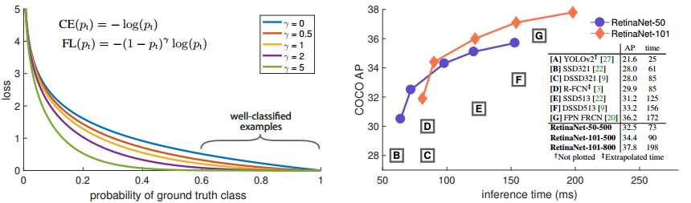
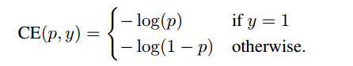
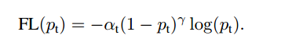
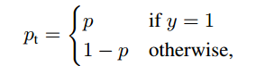

# ICCV2017: Focal Loss for Dense Object Detection
@inproceedings{lin2017focal,
  title={Focal loss for dense object detection},
  author={Lin, Tsung-Yi and Goyal, Priya and Girshick, Ross and He, Kaiming and Doll{\'a}r, Piotr},
  booktitle={Proceedings of the IEEE international conference on computer vision},
  pages={2980--2988},
  year={2017}
}

Note: This paper has won the best student reward in ICCV2017.

### 1. Introduction
---
目标检测可以分为两类：One-stage和Two-stage detector.作者认为One-stage detector不如Two-stage detector的主要原因就是foreground和background的**类别不平衡问题**.
* **Foreground-background class imbalance:** One-stage detector采取在每个feature map的location上dense sampling的方式进行检测，因此产生了大量的example，而其中大部分都是分类为background的easy example。每个这样的easy negtive产生的loss很小，但是由于数量巨大（～100k），因此会overwhelming最终的loss，导致类别不平衡的问题，影响最终性能。
* **Solution:** 调整标准的交叉熵损失函数，降低简单样本的loss权重(down-weighting)。因此这个损失函数能够使网络更关注稀疏困难样本(hard example)的训练

* **Result:** 下面左图蓝色曲线就是标准交叉熵下的loss曲线，可以看到在probability超过0.6的高置信度下，易分类样本的loss仍然不小，这是类别不平衡最终导致性能下降的原因。蓝色曲线下的各曲线则是通过调整标准交叉熵函数，降低易分类样本loss权重的结果，可以看出这里的易分类样本产生的loss很小，因此网络更关注困难样本的训练。右图是Time/AP曲线，可以看出其高效的性能。

### 2. Related work
---
* **Two-stage detector:** Faster R-CNN之类的二阶段detector解决上述类别不平衡的方法是(1)two-stage cascade;(2)sampling heuristics。首先在一阶段采用Selective Search或RPN等方法筛选大量的密集采样(e.g. ~1-2k)，然后在二阶段固定正负样本比例(1:3)，或者采用在线难样本挖掘(OHEM)

### 3. Focal loss
---
* **Cross entropy(CE Loss)**:传统的分类交叉熵

* **Balanced focal loss**:作者基于CE loss提出了Balanced focal loss，这个loss在CE loss的基础上增加了两个参数$\alpha$和$\gamma$。$p_t=p$ $y=1$,
  
  

  1. **平衡因子$\alpha$**: 一个常见的解决类别不平衡问题的方法是引入一个权重因子$\alpha$，该参数的作用是令class1的权重为$\alpha$，class-1的权重为$1-\alpha$.这个参数可以由类别频数的倒数或作为超参数确定。  
  
    
  2. **平衡因子$(1-p_t)^\gamma$**: $\alpha$能够帮助网络平衡**正负样本**，但是无法区分难易样本。因此作者在balanced CE上增加了$(1-p_t)^\gamma$这一部分。这一部分能够帮助网络更关注于**困难样本**的训练。
      (1) 如果某个样本被misclassified，而且$p_t$很小，则该部分的值接近于1,那么原来的loss几乎不受影响。如果$p_t \rightarrow 1$,则该部分的值接近于0，那么这个well-classified的样本的loss将变得很小。
      (2) 这个部分降低了来自简单样本的loss贡献，然后扩展某个样本低loss的范围。例如$\gamma=2$的情况，如果$p_t=0.9$,那么loss会降低100倍，如果$p_t=0.968$,那么loss会降低1000倍.这样子就能降低易样本对loss的权重，提升了困难样本在训练中的重要性。

### 4. Experiment
---
具体实验的部分看Paper

### 5. Discussion
---
One-stage detector中由于dense sampling导致了Foreground/Background类别不平衡的问题。作者认为这个类别不平衡的问题会导致简单样本在训练的过程中会主导loss，导致网络无法专注于困难样本的训练。因此，作者基于CE提出了Focal loss，简单的引入两个参数$\alpha$和$\gamma$，down-weighting负样本和简单样本的loss，缓解类别不平衡的问题，使得网络能够关注于困难样本的训练。实验结果显示这样简单的方法能够很好地提高One-stage detector的性能。