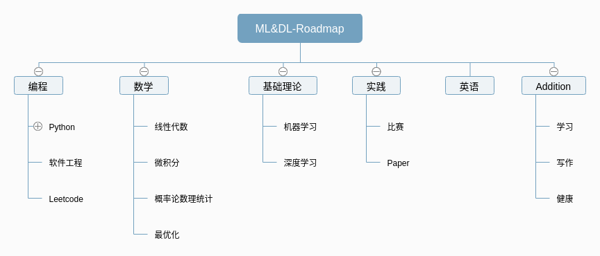

# Course and Resource for  ML&DL 
如果想要深入或掌握机器学习和深度学习，那么必须具有以下的能力:
* 扎实的编程能力
* 扎实的线性代数，概率论与统计和最优化等数学基础
* 扎实的ML和DL的领域知识
* 扎实的英语能力
* (Additional) 扎实的学习能力
* (Additional) 扎实的写作能力
* (Additional) 健康的身心

这篇Note的目的在于整理培养能力以满足上述要求的各类课程、资源和Roadmap。

---
### 0. Roadmap

首先是DL和ML的Roadmap，在github及知乎都有许多十分有指导意义的学习DL的Roadmap。
* https://github.com/emilwallner/How-to-learn-Deep-Learning
    这个Repository按照时间进度提供了学习DL的建议

* https://home.apachecn.org/learn/
    国内的相关组织，提供了很多的资源和帮助，值得参考
    https://github.com/apachecn/ai-roadmap/blob/master/ai-union-201904/README.md

Standford的公开课程
* [Stanford Engineering Everywhere (SEE)](https://see.stanford.edu/)

---
### 1. 编程
**Python**
* 基础：廖雪峰等
* 进阶：Python Cookbook
  
**软件工程**
这是高效编写代码的保障，需要通过不断的学习和实践掌握

**Leetcode**
https://leetcode.com
非常好的练习coding和数据结构算法的平台。推荐的使用方式：
* 按照tag，easy->medium->hard
* 总结每一题，每一个tag

**Numpy**
Numpy练习题100题
https://zhuanlan.zhihu.com/p/57872490
https://github.com/rougier/numpy-100

---
### 2. 数学
数学的重要性不言而喻，学习数学最重要的是练习和总结

**线性代数**
* [线性代数的本质](https://www.bilibili.com/video/av5987715?from=search&seid=11792471370017388823)
* [MIT线性代数](https://mitmath.github.io/1806/)

**微积分**
* [微积分的本质](https://www.bilibili.com/video/av24325548?from=search&seid=11792471370017388823)

**概率论与数理统计**
* [The Basics of statistics](https://www.youtube.com/watch?v=qBigTkBLU6g&list=PLblh5JKOoLUK0FLuzwntyYI10UQFUhsY9)

**最优化**
* [EE364A - Convex Optimization I](https://see.stanford.edu/Course/EE364A)

* [EE364B - Convex Optimization II](https://see.stanford.edu/Course/EE364B)

---
### 3.机器学习和深度学习基础理论
**课程**
* [cs229](https://see.stanford.edu/Course/CS229)
* [cs231n](http://cs231n.github.io/)

**书籍**
* [机器学习](https://book.douban.com/subject/26708119/)
* [统计机器学习](https://github.com/SmirkCao/Lihang)
* [深度学习](https://www.deeplearningbook.org/)

**框架**
* 掌握：[Pytorch](https://pytorch.org/)
* 掌握：[Tensorflow](https://tensorflow.org)
* Tensorflow课程：[CS 20: Tensorflow for Deep Learning Research](http://web.stanford.edu/class/cs20si/)
* [Caffe2](https://caffe.berkeleyvision.org/)
* [MXNet](https://mxnet.apache.org)

---
### 4. 英语
- [ ] TODO

---
### 5. Addition
**学习**
* 金字塔原理
* 如何高效学习
* Anki

**写作**
相信看了上述的<金字塔原理>会有收获

**Other**